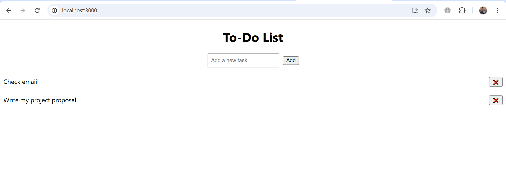

# TodoApp


A simple Todo application that allows users to add, update, delete, and mark tasks as completed. This app is designed to help users organize their tasks efficiently.

## Features

- **Add tasks**: Users can add new tasks with a description and due date.
- **Update tasks**: Users can edit existing tasks.
- **Delete tasks**: Users can delete tasks.
- **Mark tasks as completed**: Users can mark tasks as completed or not completed.
- **Filter tasks**: View tasks filtered by their status (Completed / Pending).

## Technologies Used

- Frontend: HTML, CSS, JavaScript
- Backend (if applicable): Node.js, Express (or another backend technology you are using)
- Database: (Optional, e.g., MongoDB, MySQL, etc.)

## Installation

1. Clone the repository:
 ```bash
   git clone https://github.com/GIZE21/Indolink.git
```
